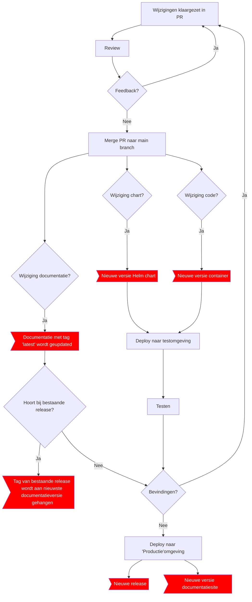

# TL;DR
[Hier zie je de workflow van een release en wat een release moet bevatten](#hoe-kom-je-tot-een-nieuwe-versie--release)

# Begrippen

## Releases
Je kan Releases aanmaken in Github. Dan koppel je een tag aan een versie van de code, en daaraan koppel je zo'n release. Daar kan je release notes in zetten, instructies voor upgraden, bestanden uploaden, enzovoorts. 
Mensen kunnen zich abonneren op releases van een repository. Een release heeft dus vooral semantische waarde en is dus niet per definitie iets dat je op zichzelf kan deployen.

[Hier lees je meer over releases in Github](https://docs.github.com/en/repositories/releasing-projects-on-github).

## Semantic versioning
Semantic versioning is en versiestramien waarbij je uit de wijziging in een versienummer kan opmaken of de wijziging al dan niet breaking is, en of er functionaliteit gewijzigd is.

[Hier lees je meer over semantic versioning](https://semver.org/)

## Conventional commits
Conventional commits is een stramien voor prefixes in commit messages. Bij automatisering omtrent semantic versioning en release notes wordt vaak gebruik gemaakt van conventional commits om aan te geven:
- Of de commit message in de release notes moet komen
- Of het om een major, minor of patch wijziging gaat

[Hier lees je meer over conventional commits](https://www.conventionalcommits.org/)

# Waar kunnen we versies aan toekennen?
## Docker images
Elke wijziging in code vereist een nieuwe versie van een docker image voordat we de wijziging kunnen deployen en testen.

We hebben voor podiumd contact de volgende docker images:
- kiss
- elastic-sync
- adapter

## Helm charts
Een nieuwe versie van een docker image vereist SOMS een nieuwe versie van de helm chart voordat we de docker image kunnen deployen en testen.

Er kan ook een nieuwe versie van de helm chart noodzakelijk zijn ZONDER dat er een nieuwe versie van een docker image is (bv obv voortschrijdend inzicht).

We hebben voor podiumd contact de volgende helm charts:
- kiss
- adapter
- elastic-sync (niet echt een helm chart, alleen wat yaml bestanden, wellicht samenvoegen met de kiss helm chart?)

## Handleidingen
Per versie van KISS kan de handleiding anders zijn. Waarschijnlijk is het verstandig om een versienummer van de handleiding bij te houden en aan te geven:
- Voor welke versie van KISS de handleiding is
- Met welke versie van componenten er getest is

### (Minimale) versie van componenten
Meer een richtlijn? 'Getest met OK2.1'
- Elasticsearch / Kibana / Enterprise Search
- Postgres
- OpenKlant
- OpenZaak
- OpenObjecten
- ESuite
- BRP / HaalCentraal
- KvK? Kan je geen versie van kiezen maar als een oude versie van Kiss er niet meer mee werkt, moeten we die versie dan deprecaten?

# Wat doen andere ontwikkelpartners
## Maykin
Maykin maakt voor OpenZaak en OpenKlant geen releases aan in github, maar voegt wel tags toe met een versienummer. Deze tag hangt aan een merge commit van een PR. Zo'n PR bevat meestal (altijd?) een losse commit met daarin een update van alle versienummers in de code, en de changelog. Soms is dit de enige commit in het PR.

De losse repo voor Helm charts van Maykin heeft wel enige automatisering, obv [de helm chart releaser](https://github.com/helm/chart-releaser-action).  Deze maakt automatisch een Release aan als er een helm chart wijzigt en zorgt dat de charts op een vriendelijke url benaderbaar zijn via github pages.
## INFO
Elk PR dat naar de main branch gemerged wordt, zorgt voor een nieuwe release. Deze release bevat op basis van conventional commits een opgehoogd versienummer en een gegenereerde beschrijving. Je kan aan de release niet zien of deze al getest is.

# Automatisering
Automatisering van semantic versioning en release notes werkt meestal op basis van conventional commits. Automatisering is niet een doel op zich, maar we kunnen wel leren van de opzet van onderstaande tools, met name Release Please.

## Release Please
- Ontwikkeld door Google
- Werkt obv Github Action
- Werkt alleen als je code op Github staat
- Leest commits uit sinds de vorige release, en werkt obv conventional commits het versienummer en de change log bij
  - `fix` zorgt voor een hoger patch nummer
  - `feat` zorgt voor een hoger minor nummer
  - `fix!`, `feat!`, `refactor!` zorgt voor een hoger major nummer
- Voor de release maakt het een PR aan
- Als je het PR open laat staan, kan je wijzigingen opsparen. Pas als je het PR mergt wordt er een release in github aangemaakt

[Hier lees je meer over Release Please](https://github.com/googleapis/release-please)

## Semantic Release
- Werkt obv npm packages
- Onafhankelijk van of je code op Github staat of ergens anders

[Hier lees je meer over Semantic Release](https://semantic-release.gitbook.io/)

# Hoe kom je tot een nieuwe versie / release?

Tags van docker images en versies van helm charts volgen NIET de versie van een release. Tegen de tijd dat we een serie wijzigingen gezamenlijk als productiewaardig achten, en in lijn met afspraken met de opdrachtgever, maken we een Release aan in de kiss-frontend repository in github, met een versienummer op basis van Semantic Versioning. In de release vermelden we:
- Een korte samenvatting van de nieuwe functionaliteiten / bug fixes
- Een link naar de bijbehorende, al dan niet nieuwe docker images inclusief tag
- Een link naar de bijbehorende, al dan niet nieuwe helm charts inclusief versienummer
- Een link naar de bijbehorende, al dan niet nieuwe documentatie

Door in de [documentatie-repository](https://github.com/Klantinteractie-Servicesysteem/.github) een tag toe te voegen met het versienummer van de release, komt er een nieuwe versie van de documentatie in readthedocs.
