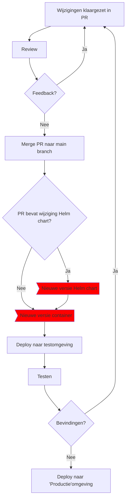

# Begrippen

## Releases
Je kan Releases aanmaken in Github. Dan koppel je een tag aan een versie van de code, en daaraan koppel je zo'n release. Daar kan je release notes in zetten, instructies voor upgraden, bestanden uploaden, enzovoorts. 
Mensen kunnen zich abonneren op releases van een repository. Een release heeft dus vooral semantische waarde en is dus niet per definitie iets dat je op zichzelf kan deployen.
[Hier lees je meer over releases in Github](https://docs.github.com/en/repositories/releasing-projects-on-github)

## Semantic versioning
Semantic versioning is en versiestramien waarbij je uit de wijziging in een versienummer kan opmaken of de wijziging al dan niet breaking is, en of er functionaliteit gewijzigd is.
[Hier lees je meer over semantic versioning](https://semver.org/)

## Conventional commits
Conventional commits is een stramien voor prefixes in commit messages. Bij automatisering omtrent semantic versioning en release notes wordt vaak gebruik gemaakt van conventional commits om aan te geven:
- Of de commit message in de release notes moet komen
- Of het om een major, minor of patch wijziging gaat
[Hier lees je meer over conventional commits](https://www.conventionalcommits.org/)

# Waar kunnen we versies aan toekennen?
## Docker images
Elke wijziging in code vereist een nieuwe versie van een docker image voordat we de wijziging kunnen deployen en testen.

We hebben voor podiumd contact de volgende docker images:
- kiss
- elastic-sync
- adapter

## Helm charts
Een nieuwe versie van een docker image vereist SOMS een nieuwe versie van de helm chart voordat we de docker image kunnen deployen en testen.

Er kan ook een nieuwe versie van de helm chart noodzakelijk zijn ZONDER dat er een nieuwe versie van een docker image is (bv obv voortschrijdend inzicht).

We hebben voor podiumd contact de volgende helm charts:
- kiss
- adapter
- elastic-sync (niet echt een helm chart, alleen wat yaml bestanden, wellicht samenvoegen met de kiss helm chart?)

## (Minimale) versie van componenten
Meer een richtlijn? 'Getest met OK2.1'
- Elasticsearch / Kibana / Enterprise Search
- Postgres
- OpenKlant
- OpenZaak
- OpenObjecten
- ESuite
- BRP / HaalCentraal
- KvK? Kan je geen versie van kiezen maar als een oude versie van Kiss er niet meer mee werkt, moeten we die versie dan deprecaten?

# Hoe kom je tot een nieuwe versie / release?
- Waar in de onderstaande flow gaan we communiceren over versies?
- Hoe communiceren we dat versies productieklaar zijn
- Wanneer maken we een Release aan in Github? Als er versies productieklaar zijn? Of doen we dat al voor elke nieuwe versie van de container/chart?

```mermaid
flowchart TD
  A[Wijzigingen klaargezet in PR] --> B[Review]
  B --> C{Feedback?}
  C -->|Ja| A
  C -->|Nee| L[Merge PR naar main branch]
  L --> E{PR bevat wijziging Helm chart?}
  E -->|Ja| F>Nieuwe versie Helm chart]
  E -->|Nee| D
  F --> D>Nieuwe versie container]
  D --> G[Deploy naar testomgeving]
  G --> H[Testen]
  H --> I{Bevindingen?}
  I -->|Ja| A
  I -->|Nee| J[Deploy naar 'Productie'omgeving]
  style D fill:red
  style F fill:red
```
# Automatisering
Automatisering van semantic versioning en release notes werkt meestal op basis van conventional commits. 

## Release Please
- Werkt obv Github Action
- Werkt alleen als je code op Github staat
[Hier lees je meer over Release Please]()

## Semantic Release
- Werkt obv npm packages
- Onafhankelijk van of je code op Github staat of ergens anders
[Hier lees je meer over Semantic Release](https://semantic-release.gitbook.io/)

# Wat doen andere ontwikkelpartners
## Maykin
## INFO

