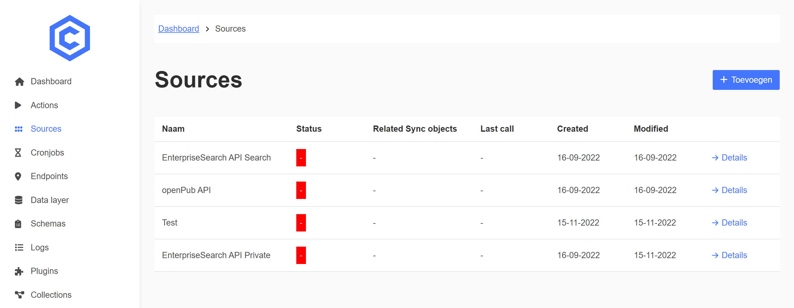
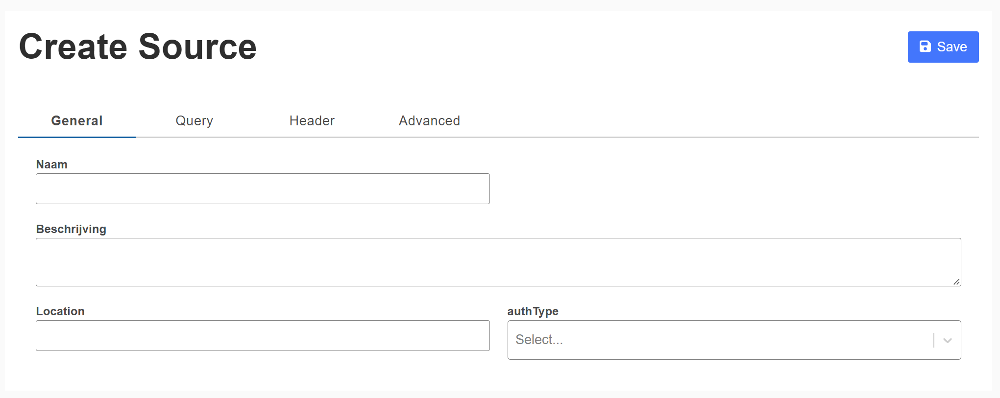
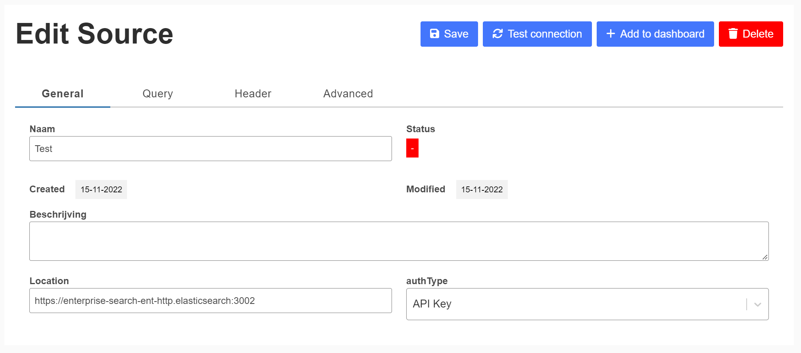
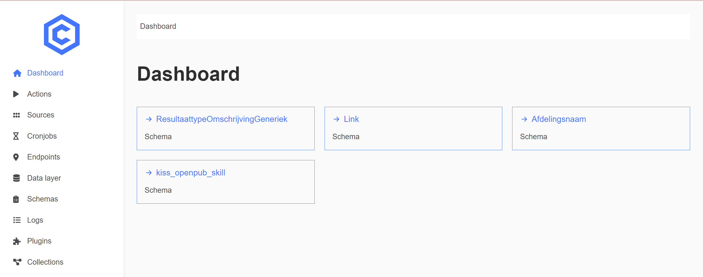

# Configuratie

## Koppelen van nieuwe bronnen
De Commongateway als core onder kiss bied de optie om extra bronnen (applicaties te koppelen) zonder dat het nodig is om hiervoor een ontwikkelpartij in te schakkelen of code te schrijven.

Log hiervoor in op de admin omgeving en ga naar het menu item "sources", daar kunt u bestaande bronnen bewerken en nieuwe bronnen toevoegen

Voor het toevoegen van een bron klikt u op "Toevoegen", daar kunt u de locatie de externe api en eventueele authorisatie inregelen.

Nadat de bron is toegevoegd is het ook mogenlijk om de connectie naar de bron toe te testen, het verdient een warme aan beveling om dit te doen VOORDAT u verder gaat met de inrichting van de externe bron. U kunt de verbinding naar een bron toe testen door op "test connection" te klikken.

Als de bron succesvol is toegevoegd en de verbinding getest moet de bron nog worden gekoppeld aan een van de in kiss bekende objecten. Dit gaat door het inregelen van zogenoemde synchronisatie acties. Synchronisaties acties gaan (net als alle andere acties in de gateway) af als zich een EVENT voordoet. Voorbeelden van events voor het sycnhonyseren van bronnen zijn:
- Het object veranderd in KISS (bijwerken naar de bron toe)
- Het object veranderd in de BRON (ophalen vanuit de bron)

## Opzetten van proxies

## Beheer op Selectielijsten
Op het beheer dashboard vind u een aantal cards die doorverwijzen naar de diverse beschickbare selectielijsten

Het klikken op een van deze cards leid naar een overzicht lijst van de verschillende items die onderdeel zijn van deze lijst. Hier kunt u items toevoegen, bewerken (via de details knop) en verwijderen.

